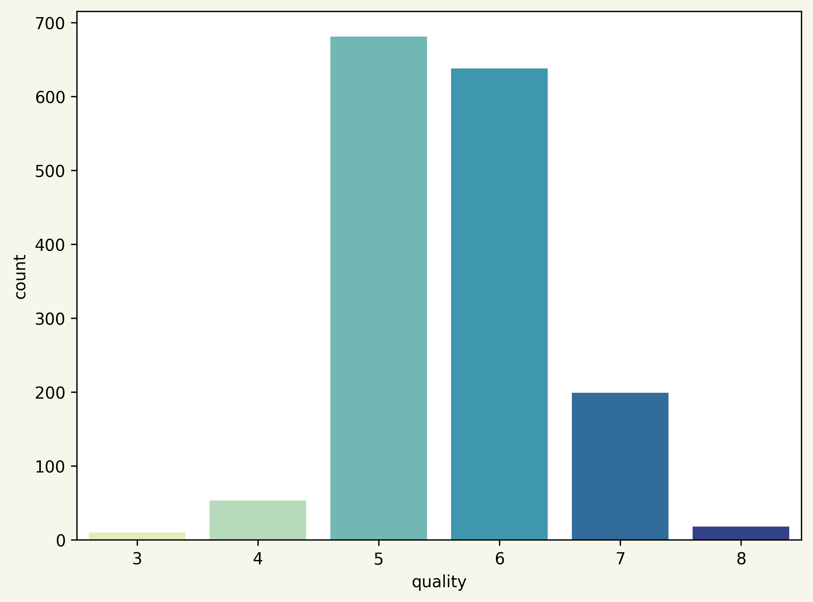
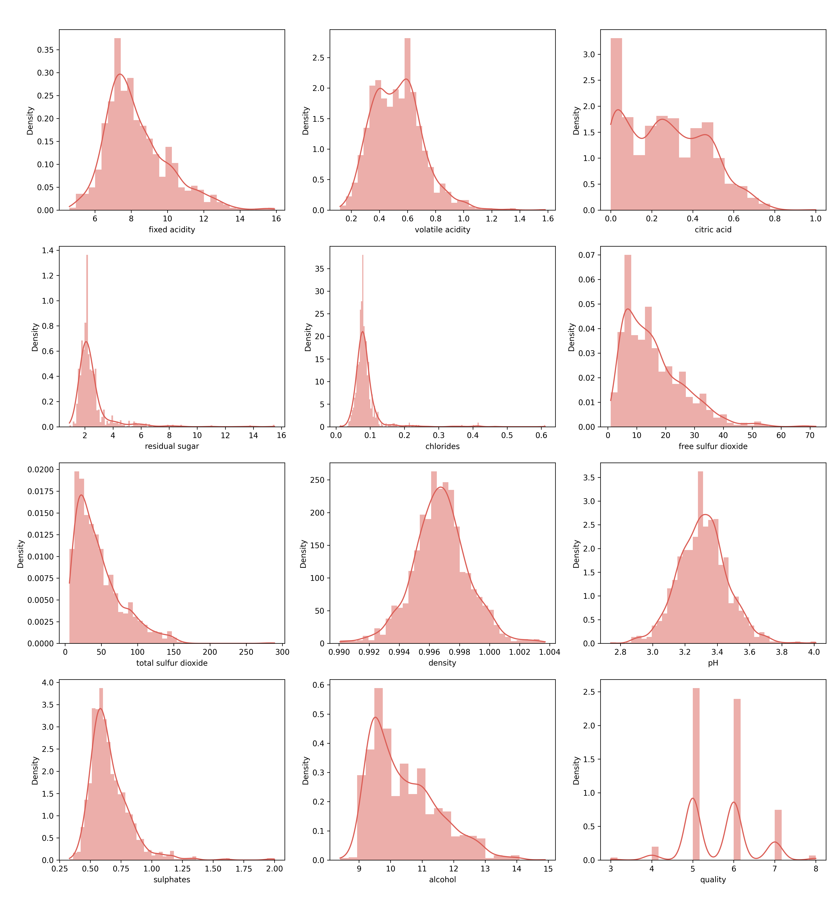
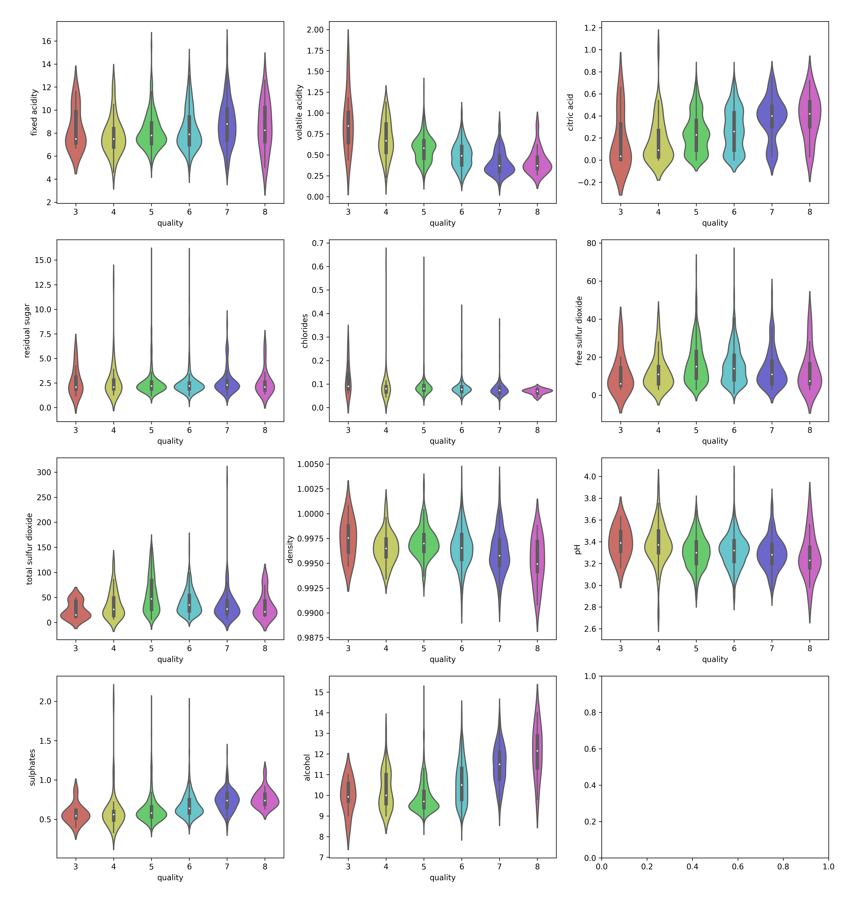

<h1 align="center"><b>Softmax Regression</b></h1>

## 1. GIỚI THIỆU
Hồi quy Softmax (Softmax Regression) là một thuật toán học có giám sát (supervised learning), mặc dù tên gọi có chứa từ "hồi quy" nhưng đây là thuật toán thuộc loại classification. Nó tính toán mối quan hệ giữa các đặc trưng trong input và output dựa trên hàm softmax. Thực tế cho thấy nó là một trong những thuật toán Machine Learning được sử dụng phổ biến nhất.

Hồi quy Softmax (hay hồi quy logistic đa thức) là tổng quát của hồi quy logistic trong trường hợp chúng ta muốn xử lý nhiều lớp. Trong hồi quy logistic, chung tôi giả định rằng các nhãn là nhị phân , nhưng trong hồi quy Softmax cho phép chúng tôi xử lý  với  là số lớp.

Trong cài đặt hồi quy softmax, chúng tôi quan tâm đến phân loại nhiều lớp (thay vì chỉ phân loại nhị phân), và vì vậy nhãn y có thể đảm nhiệm  các giá trị khác nhau, thay vì chỉ có hai. 

## 2. PHƯƠNG PHÁP
Ý tưởng của bài toán là tương tự như bài toán hồi quy logistic, bài toán hồi quy softmax thay thế hàm sigmoid thành hàm softmax để có thể sử dụng cho bài toán phân loại nhiều lớp hơn.


### 2.1 Hàm Softmax
Chúng ta cần một mô hình xác suất sao cho với mỗi input ,  thể hiện xác suất để input đó rơi vào lớp i. Vậy điều kiện cần là các  phải dương và tổng của chúng bằng 1. Để có thể thỏa mãn điều kiện này, chung ta cần nhìn vào mọi giá trị  và dựa trên các quan hệ giữa các  này để tính toán giá trị của .
Ngoài các điều kiện  lớn hơn 0 và có tổng bằng 1, chúng ta sẽ thêm một điều kiện cũng rất tự nhiên nữa, đó là: giá trị  càng lớn thì xác suất dữ liệu rơi vào lớp i càng cao.
Điều kiện cuối này chỉ ra rằng chúng ta cần một hàm đồng biến ở đây.

Chú ý rằng  có thể nhận giá trị cả âm và dương. Vì thế ta sử dụng hàm  thì có thể chắc chắn biến  thành một số dương, đồng biến. Điều kiện cuối cùng, tổng các  bằng 1 có thể được đảm bảo nếu:

 

Hàm số này, tính tất cả các  dựa vào tất cả các , thỏa mãn tất cả các điều kiện đã xét: dương, tổng bằng 1, giữ được thứ tự của . Hàm số này được gọi là hàm softmax.

Lúc này, ta có thể giả sử rằng:

; 

Trong đó, ;  được hiểu là xác suất để một điểm dữ liệu  rơi vào lớp thứ i nếu biết tham số mô hình (ma trận trọng số) là .

### 2.2 Hàm mất mát và phương pháp tối ưu

#### 2.2.1 One hot coding
Với bài toán phân loại nhiều lớp thì mỗi output sẽ không còn là một giá trị tương ứng với mỗi lớp nữa mà sẽ là một vector có đúng một phần tử bằng 1, các phần tử còn lại bằng 0. Phần tử bằng 1 nằm ở vị trí tương ứng với lớp đó, thể hiện rằng điểm dữ liệu đang xét rơi vào lớp này với xác suất bằng 1. Cách mã hóa output này được gọi là one-hot coding. Khi sử dụng mô hình Softmax Regression, với mỗi đầu vào , ta sẽ có đầu ra dự đoán là .
Trong khi đó, đầu ra thực sự chúng ta có là vector  được biểu diễn dưới dạng one-hot coding.

Hàm mất mát sẽ được xây dựng để tối thiểu sự khác nhau giữa đầu ra dự đoán  và đầu ra thực sự . Một lựa chọn đầu tiên ta có thể nghĩ tới là:


Tuy nhiên đây chưa phải là một lựa chọn tốt. Khi đánh giá sự khác nhau (hay khoảng cách) giữa hai phân bố xác suất (probability distributions), chúng ta có một đại lượng đo đếm khác hiệu quả hơn. Đại lượng đó có tên là cross entropy.

#### 2.2.2. Cross Entropy
Cross entropy giữa hai phân phối  và  được định nghĩa là:


Với  và  là rời rạc (như  và  trong bài toán của chúng ta), công thức này được viết dưới dạng:

 

Để hiểu rõ hơn ưu điểm của hàm cross entropy và hàm bình phương khoảng cách thông thường, chúng ta cùng xem Hình 4 dưới đây. Đây là ví dụ trong trường hợp  và  lần lượt nhận các giá trị ,  và .

  

Hình 4: So sánh giữa hàm cross entropy và hàm bình phương khoảng cách. Các điểm màu xanh lục thể hiện các giá trị nhỏ nhất của mỗi hàm.

Có hai nhận xét quan trọng sau đây:

  + Giá trị nhỏ nhất của cả hai hàm số đạt được khi  tại hoành độ của các điểm màu xanh lục.

  + Quan trọng hơn, hàm cross entropy nhận giá trị rất cao (tức loss rất cao) khi  ở xa . Trong khi đó, sự chênh lệch giữa các loss ở gần hay xa nghiệm của hàm bình phương khoảng cách  là không đáng kể. Về mặt tối ưu, hàm cross entropy sẽ cho nghiệm gần với  hơn vì những nghiệm ở xa bị trừng phạt rất nặng.

Hai tính chất trên đây khiến cho cross entropy được sử dụng rộng rãi khi tính khoảng cách giữa hai phân phối xác suất.

Chú ý: Hàm cross entropy không có tính đối xứng . Điều này có thể dễ dàng nhận ra ở việc các thành phần của  trong công thức  có thể nhận giá trị bằng 0, trong khi đó các thành phần của  phải là dương vì  không xác định. Chính vì vậy, khi sử dụng cross entropy trong các bài toán supervised learning,  thường là đầu ra thực sự vì đầu ra thực sự chỉ có 1 thành phần bằng 1, còn lại bằng 0 (one-hot),  thường là đầu ra dự đoán, khi mà không có xác suất nào tuyệt đối bằng 1 hoặc tuyệt đối bằng 0 cả.

Với Softmax Regression, trong trường hợp có  classes, loss giữa đầu ra dự đoán và đầu ra thực sự của một điểm dữ liệu  được tính bằng:


Với  và  lần lượt là là phần tử thứ j của vector (xác suất)  và . Nhắc lại rằng đầu ra  phụ thuộc vào đầu vào  và ma trận trọng số .

#### 2.2.3. Hàm mất mát cho Softmax Regression
Kết hợp tất cả các cặp dữ liệu , chúng ta sẽ có hàm mất mát cho Softmax Regression như sau:


Với ma trận trọng số  là biến cần tối ưu. Hàm mất mát này trông có vẻ đáng sợ, nhưng đừng sợ, đọc tiếp các bạn sẽ thấy đạo hàm của nó rất đẹp (và đáng yêu).

#### 2.2.4. Tối ưu hàm mất mát
Với chỉ một cặp dữ liệu ), ta có:

 (3)

trong biến đổi ở dòng cuối cùng, tôi đã sử dụng quan sát:  vì nó là tổng các xác suất.

Tiếp theo ta sử dụng công thức:

 (4)

Trong đó, gradient theo từng cột có thể tính được dựa theo (3):

 (5)

Trong đó, giá trị  có thể coi là sai số dự đoán.

Đến đây ta đã được biểu thức rất đẹp rồi. Kết hợp (4) và (5) ta có:


Từ đây ta cũng có thể suy ra rằng:


với 

Giả sử rằng chúng ta sử dụng SGD, công thức cập nhật cho ma trận trọng số  sẽ là:


## 3. CÀI ĐẶT CHƯƠNG TRÌNH

### 3.1 Trực quan hóa và phân tích sơ bộ dữ liệu

#### 3.1.1 Phân tích sơ bộ

Dưới đây là mô tả sơ bộ dữ liệu cho các trường. Nhìn chung bộ dữ liệu là đầy đủ và không mất mát nên ta không phải thực hiện implement trên bộ dữ liệu này.


|       |   fixed acidity |   volatile acidity |   citric acid |   residual sugar |   chlorides |   free sulfur dioxide |   total sulfur dioxide |   density |       pH |   sulphates |   alcohol |   quality |
|:------|----------------:|-------------------:|--------------:|-----------------:|------------:|----------------------:|-----------------------:|----------:|---------:|------------:|----------:|----------:|
| count |        1599.000 |           1599.000 |      1599.000 |         1599.000 |    1599.000 |              1599.000 |               1599.000 |  1599.000 | 1599.000 |    1599.000 |  1599.000 |  1599.000 |
| mean  |           8.320 |              0.528 |         0.271 |            2.539 |       0.087 |                15.875 |                 46.468 |     0.997 |    3.311 |       0.658 |    10.423 |     5.636 |
| std   |           1.741 |              0.179 |         0.195 |            1.410 |       0.047 |                10.460 |                 32.895 |     0.002 |    0.154 |       0.170 |     1.066 |     0.808 |
| min   |           4.600 |              0.120 |         0.000 |            0.900 |       0.012 |                 1.000 |                  6.000 |     0.990 |    2.740 |       0.330 |     8.400 |     3.000 |
| 25%   |           7.100 |              0.390 |         0.090 |            1.900 |       0.070 |                 7.000 |                 22.000 |     0.996 |    3.210 |       0.550 |     9.500 |     5.000 |
| 50%   |           7.900 |              0.520 |         0.260 |            2.200 |       0.079 |                14.000 |                 38.000 |     0.997 |    3.310 |       0.620 |    10.200 |     6.000 |
| 75%   |           9.200 |              0.640 |         0.420 |            2.600 |       0.090 |                21.000 |                 62.000 |     0.998 |    3.400 |       0.730 |    11.100 |     6.000 |
| max   |          15.900 |              1.580 |         1.000 |           15.500 |       0.611 |                72.000 |                289.000 |     1.004 |    4.010 |       2.000 |    14.900 |     8.000 |

Hầu hết các trường có độ lệch chuẩn tương đối thấp ở mức dưới 2 (chiếm xấp xỉ 83%). Tuy nhiên có 2 trường đó là:

- `free sulfur dioxide` tức lượng tồn tại tự do của  (nghĩa là khí này tồn tại dưới dạng khí hòa tan hoặc bisulfite

- `total sulfur dioxide` tổng lượng 

Có độ lệch chuẩn cao lần lượt là **10.46** và **32.9**. 2 trường dữ liệu này tuy liên quan đến nhau song thể hiện những ý nghĩa riêng biệt. Trong khi lượng tồn tại tự do của Sulfur dioxide giúp ức chế sự phát triển của vi khuẩn thì tổng lượng Sulfur dioxide lại liên quan nhiều hơn ở mức độ cảm nhận của khứu giác. Vì vậy 2 yếu tố này có thể nói là độc lập về độ ảnh hưởng đến chất lượng rượu.



​	Phân bổ trường **quality** tức trường dữ liệu mà ta đang xét cho mục đích dự đoán có thể nói là phân bổ theo hình chuông và nghiêng về bên phải với giá trị tâm moment thứ ba là 0.218 và độ lệch chuẩn tương đối thấp. Điểm chất lượng tập trung mạnh ở 5 6.

### 3.1.2 Phân bổ của dữ liệu



​	

​	Có thể thấy đa phần các trường dữ liệu phân bổ theo phân phối chuẩn và có độ lệch cao, một số trường dữ liệu như `alcohol,fixed acidity, free sulfur dioxidetotal, sulfur dioxide ` còn phân phối theo dạng **PERT**. 

​	

​	Cá biệt khi nhìn vào đường KDE của trường `volatile acidity` ta có thể thấy rằng trường này có dạng **Bimodal**. Trường này thể hiện lượng axit trong rượu, nếu quá cao có thể gây vị dấm khó chịu. Khi dữ liệu phân bố dạng **Bimodal** ta thương phải phân tích thêm để có thể đưa ra 2 trường mới thể hiện dưới dạng hình chuông. Tuy nhiên với tính chất của trường dữ liệu này vốn phụ thuộc vào giác quan ở một mức độ, khi lượng axit trong rượu ở dưới một mức nhất định, thì trường dữ liệu này không ảnh hưởng quá nhiều đến chất lượng rượu.

​	

​	Ở bảng dữ liệu này, ngoài trường dữ liệu là `residual sugar` và `PH` vốn thể hiện không quá rõ ràng sự tương quan với `quality` ngoài ra có thể nhận xét sơ bộ như sau:

1. `fixed acidity` Rượu với điểm càng cao thì có độ lệch chuẩn ở thông số này càng cao, chứng tỏ rằng khi rượu càng cao cấp thì trọng lượng của thông số này càng nhẹ đi. Ngoài ra chất lượng rượu cũng có đôi chút liên quan tỉ lệ thuận với trung bình của thông số này, điều này chứng tỏ rằng nồng độ axit của rượu có liên quan đến chất lượng vì lượng axit này không bay hơi hoặc mất đi để tạo ra mùi mà thay vào đó nằm trong rượu để cân bằng và tạo vị. Tuy nhiên cá biệt là điểm 8 trong chất lượng lại có lượng axit thấp hơn điểm 7.

2. `volatile acidity` Đây là lượng axit bay hơi, có thể thay đổi trong khi để rượu trong decanters. Như dự đoán lượng axit này nếu quá lớn sẽ ảnh hưởng đến vị của rượu (có thể không ảnh hưởng quá nhiều đến mùi do quá trình nghỉ) nên trung bình của thông số này tỉ lệ nghịch với chất lượng rượu.

3. `citric acid` Trường này có trung bình tương đối tỉ lệ thuận với chất lượng

4. `chlorides` Có thể thấy rằng rượu với điểm chất lượng cao (7,8) có lượng Clo tương đối ổn định và độ lệch chuẩn thấp. Chúng giao động nhỏ ở một mức nhất định trong khi rượu chất lượng thấp có mức giao động rất lớn ở thông số này.

5. `free sulfur dioxide` và `total sulfur dioxide` Nhìn vào chấm trắng trung bình của 2 trường này có thể thấy chúng phân bổ theo phân phối chuẩn với mức trung bình sulfur dioxide cao với các loại rượu trung cấp và thấp ở các loại rượu cao cấp và kém chất lượng.

6. `density` Thông số này phụ thuộc vào lượng đường và độ cồn trong rượu. Phân phối tương đối rộng ở mức thấp với các loại rượu đắt tiền và ổn định ở mức cao với các loại rượu thấp hơn.

7. `sulphates` Trường này có giá trị trung bình tỉ lệ thuận với chất lượng rượu

8. `alcohol` Ngoài cá biệt ở điểm 5 có mức lệch chuẩn thấp và ngược lại với các giá trị trung bình, Trường này có giá trị trung bình tỉ lệ thuận với chất lượng rượu.

### Hiện thực hóa ý tưởng với Python
Dựa trên phương pháp và phần giải thích toán học được nêu ra ở trên, chúng ta thực hiện tuần tự theo các bước để xây dựng một mô hình Softmax Regression.
#### Hàm softmax
Dưới đây là mã nguồn thực hiện tính toán hàm softmax   với đầu vào là một ma trận **Z** và đầu ra là một ma trận **A** với mỗi cột là một vector **a** được tính bằng hàm softmax với đầu vào là **z** với mỗi phần từ trong vector là thể hiện khả năng điểm dữ liệu được phân vào các lớp tướng ứng
Với trường hợp khi **z** quá lớn  có thể dẩn đến hiện tượng tràn số gây sự sai lệch cho kết quả của hàm softmax. Vậy phương pháp được đề xuất ra để khắc phục hiện tượng overflow là trừ đi  một giá trị đủ lớn, giá trị đủ lớn này thường được chọn là  , chúng ta có triển khai như sau
```python
def softmax(Z):
    """
    Tính toán hàm softmax dựa trên các trường dữ liệu 
    của mỗi điểm dữ liệu tương ứng là các cột của ma trận Z
    """
    # tính giá trị z qua đó tính được giá trị của exp(z)
    e_Z = np.exp(Z - np.max(Z, axis = 0, keepdims = True))
    # tính giá trị a
    A = e_Z / e_Z.sum(axis = 0)
    return A
```
#### Hàm mất mắt Cross Entropy 
Hàm mất mát được sây dựng dựa trên hàm Cross Entropy với công thức toán học được biểu diễn lại như sau:  dựa trên công thức này, chúng ta có thể dể dàng triển khai mã bằng python như sau

```python
def lost_softmax(X, Y, W):
    """
    Hàm mất mát của mô hình Softmax Regression
    """
    # Tính toán ma trận A bằng hàm softmax xây dựng ở trên
    A = softmax(W.T.dot(X))
    # Hàm trả về giá trị của hàm mất mất để chúng ta thực hiện tối ưu
    return -np.sum(Y*np.log(A))
```
#### Tối ưu hàm mất mát bằng Stochastic gradient descent
Với các hàm nền tảng được xây dựng ở trên, ở bước tiếp theo này chúng ta thực hiện xây dựng hàm cho mục đích tối ưu hàm mất mát dựa trên phương pháp Stochastic gradient descent để dần dần tính toán và cập nhật ma trận trong số **W** tiến tới tối thiểu hàm mất mát trong một khoảng tài nguyên cho phép.
```python
def softmax_regression(X, y, W_init, eta, tol = 1e-7, max_count = 100000):
    """
    Hàm tìm ma trận trọng số W cho mục tiêu cực tiểu được hàm mất mát 
    """
    # Khởi tạo ma trận trọng số W tại một điểm bất kỳ trên miền dữ liệu từ đó sử dụng Gradient Descent tiến tới điểm cực tiểu
    W = [W_init]    
    # C được gán giá trị là số lượng các lớp hay label 
    C = W_init.shape[1]
    # Ma trận Y one-hot encoding từ vector output y 
    Y = convert_labels(y, C)
    # N, d lần lượt là các giá trị số lượng điểm dử liệu, chiều dữ liệu
    N = X.shape[1]
    d = X.shape[0]
    
    # biến đếm count để giới hạn số lần lặp trong khoảng tài nguyên cho phép 
    count = 0
    check_w_after = 20
    while count < max_count:
        # xáo trộn dữ liệu
        mix_id = np.random.permutation(N)
        for i in mix_id:
            xi = X[:, i].reshape(d, 1)
            yi = Y[:, i].reshape(C, 1)
            ai = softmax(np.dot(W[-1].T, xi))
            # Cập nhật lại ma trận trong số mới
            W_new = W[-1] + eta*xi.dot((yi - ai).T)
            count += 1
            # Kiểm tra điều kiện dừng
            if count%check_w_after == 0:      
                if np.linalg.norm(W_new - W[-check_w_after]) < tol:
                    return W
            W.append(W_new)
    return W
```
#### Các hàm hổ trợ khác 
1. Hàm Softmax Regression là một thuật toán được sử dụng dần cho bài toán phần lớp đặc biệt dần cho bài toán đa lớp, và bài toán sẽ được tối ưu hơn về mặt biểu diển và tính toán dựa trên cách mã hóa các output hay label bằng one-hot encoding, với mỗi output sẽ không còn là một giá trị tương ứng với mỗi class nữa mà được biểu diển bằng một vector có đúng 1 phần tử bằng 1, các phần tử còn lại bằng 0. Phần tử bằng 1 năm ở vị trí tương ứng với class đó, thể hiện rằng điểm dữ liệu đang xét rơi vào class này với xác suất bằng 1 ví dụ với một điểm dữ liệu có label là class thứ 2 trong một tập dữ liệu có 3 class, dó đó nó được biểu diển bằng một vector ```[0, 1, 0]``` 
2.  Hàm dự đoán `pred` dựa trên các tham số đầu vào ma trận trọng số **W** và ma trận tập các điểm dư liệu **X** với kết quả lần lượt là một vector dư đoán lớp của các điểm dử liệu đâu vào 
```python
def pred(W, X):
    """
    Dự đoán lớp được phân loại của mỗi điểm dữ liệu tương ứng với mỗi cột X
    lớp của mỗi x_i được xác định theo vị trí của xác suất tối đa
    với lớp được lập chỉ mục bởi [0, 1, 2, ...., C-1]
    """
    A = softmax(W.T.dot(X))
    
    return np.argmax(A, axis = 0)
```
## 4. BÀI TẬP
Ứng dụng các bước triển khai mã nguồn ở trên và dựa vào phân tích, trực quán hóa dữ liệu chúng ta tiến hành thực hiện bài tập phân lớp với mục tiêu đề ra là với dữ liệu đầu vào là các trường thông tin fixed acidity, volatile acidity, citric acid, residual sugar, chlorides, free sulfur dioxide, total sulfur dioxide, density,       pH, sulphates, alcohol thì có thể phân loại ra chất lượng rượu `quality` nằm trong khoảng từ **3 đến 8** hay thuộc vào các label `[3, 4, 5, 6, 7, 8]`, tuần tự các bước thực thực hiện được bao gồm:
### Chuẩn bị, phân tích dữ liệu và tiền sử lý dữ liệu 
Trong bài tập mẫu này chúng ta sử dụng bộ dữ liệu [Red Wine Quality](https://www.kaggle.com/datasets/uciml/red-wine-quality-cortez-et-al-2009?fbclid=IwAR0YYLnFmvLO3FQnGK-Du__-filz1h8-zDwVI3MKbeZM9xfE4_wdRiqQoiM) và thông tin về trực quán hóa và phân tích dữ liệu đã được trình bài cụ thẻ ở mục trên.
Qua phân tích dữ liệu chúng ta nhận thấy rằng trong bộ dữ liệu đều được biểu diển bằng dạng số và không có dữ liệu thiếu hoặc lệch quá nhiều do đó chúng ta chỉ sử dụng bước chuẩn hóa dữ liệu để tăng hiệu quả cho mô hình huấn luyện.
### Huấn luyện mô hình và kết quả 
1. Ở bước tiêp theo này, chúng ta chia tập dữ liệu thành 2 phần bao gồm tập train và tập test với tỉ lệ là 8:2 để phục vụ cho mục đích huấn luyện và đánh giá mô hình, vì dử liệu mẫu này phục vụ cho việc tìm hiểu về cách hoạt động và xậy dưng mô hình Softmax Regression nên chúng ta không nhất thiết phải chia thêm tập kiểm thử và chúng ta cũng sử dụng toàn bộ trường dữ liệu cho việc huấn luyện.
```python
# tập dữ liệu train 
df_train = df.sample(frac=0.8, random_state=1)
# tập dữ liệu test 
df_test=df.drop(df_train.index)
```
2. Tiếp theo chúng ta tách dữ liệu thành các trường đầu vào input và output và đưa về kiểu dữ liệu phù hợp cho các tham số đầu vào của các hàm ta đã xây dựng ở trên ở đầy cụ thể là kiểu dử liệu `numpy.array`
```python
### tập dữ liệu train
# ma trận X 
y_train = df_train['quality']
# vector y chứa các label phân lớp
X_train = df_train.drop(columns=['quality'])
### tập dữ liệu test
# ma trận X
y_test = df['quality']
# vector y chứa các label phân lớp
X_test = df.drop(columns=['quality'])
```
3. Bước kế tiếp, chúng ta chuẩn hóa dữ liệu bằng phương pháp **StandardScaler** như đã đề cập ở trên để tăng độ hiệu quả cho mô hình 
```python
###StandardScaler
std_scaler = StandardScaler()
df_train_scaled = std_scaler.fit_transform(X_train.to_numpy())
# reshape lại ma trận để phù hợp cho đầu vào của tham số cho hàm huốn luyện
X_train_scaled = df_train_scaled.T
```
Sau khi chuẩn hóa dữ liệu ta thu được một ma trận **X** `df_train_scaled` phục vụ cho việc huấn luyện mô hình
4. Huận luyện mô hình
```python
# eta là giá trị đại diển cho tốc độ học(learning rate) đưa vào tham số của mô hình Softmax Regression
eta = .03 
# d,c là các biến lần lượt là chiều dữ liệu và số lớp của mô hình để ta có thể khởi tạo ma trận trong số W ban đầu
d = X_train_scaled.shape[0]
# khởi tạo ma trận trọng số ban đầu
W_init = np.random.randn(d, C)
W = softmax_regression(X_train_scaled, y_train, W_init, eta)
```
5. Kết quả
```python
# chuẩn hóa dử liệu test tượng tư như với tập train
df_test_scaled = std_scaler.transform(X_test.to_numpy())
X_test_scaled = df_test_scaled.T
# vector chứa các lớp được dự đoán của tập test
quality_predict = pred(W[-1],X_test_scaled)
```
Đánh giá kết quả của mô hình 
```python
# Xuất kết quả đánh giá mô hình
print(classification_report(y_test, quality_predict))
``` 
```txt
  precision    recall  f1-score   support

           3       0.00      0.00      0.00        10
           4       0.13      0.21      0.16        53
           5       0.67      0.72      0.70       681
           6       0.55      0.49      0.52       638
           7       0.30      0.31      0.30       199
           8       0.06      0.06      0.06        18

    accuracy                           0.55      1599
   macro avg       0.29      0.30      0.29      1599
weighted avg       0.55      0.55      0.55      1599
```
Qua các bước thực hiện ở trên, chúng ta có thể hiểu thêm và nắm rõ hơn về cách hoạt động của mô hình Softmax Regression và từ đó có thể tự mình xây dựng mô hình phân lớp Softmax cho các bài toán khác nhau.

## 5. KẾT LUẬN
Mô hình Softmax Regression với ưu điểm là được sử dụng trong bài toán phân loại cho đa lớp, nên mô hình Softmax Regression là một trong những mô hình phổ biển được dùng hiện này. Ngoài ra thuật toán Softmax đặc biệt được sử dụng nhiều trong các mạng Neural có nhiều lớp, với những lớp trước được sử dụng cho mục đích trích xuất đặc trưng và lớp cuối cùng cho bài toán phần lớp là mô hình Softmax Regression

## THAM KHẢO
1. http://deeplearning.stanford.edu/tutorial/supervised/SoftmaxRegression/
2. https://machinelearningcoban.com/2017/02/17/softmax/
3. https://colab.research.google.com/drive/1jZIHiTE7yYBr5-OdxAxjbBeZ0YbM1rKD?usp=sharing
4. https://colab.research.google.com/drive/1MY0luobtabpuV1eB10gtmovyu1ImpCxy?usp=sharing
